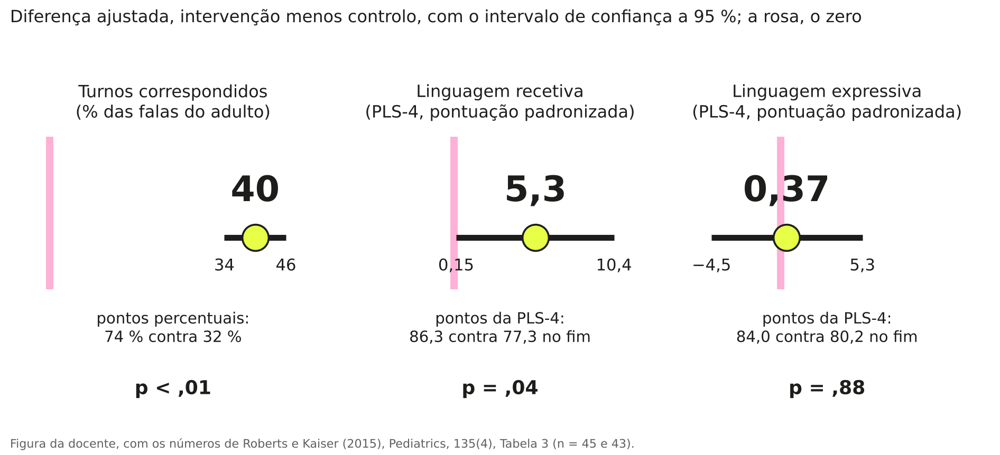
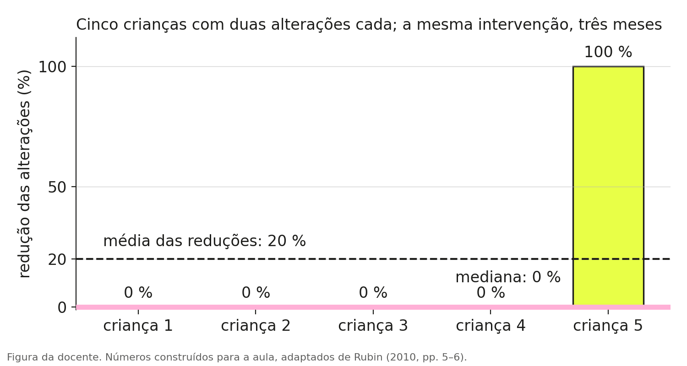

# O que diz [uma frase de resultados]{.hl}?

O estudo é um ensaio aleatorizado com 97 crianças de 24 a 42 meses com atraso de linguagem [@roberts2015]. Um grupo de famílias aprendeu, em 28 sessões ao longo de três meses, a usar estratégias de facilitação da linguagem com a criança; o outro grupo continuou com os cuidados habituais. No fim dos três meses compararam-se os dois grupos. A leitura que se segue é a que fazemos na aula.

::: {.fio}
::: {.msg}

O artigo

::: {.clip}
Os cuidadores melhoraram o uso de todas as estratégias de facilitação da linguagem, como os turnos correspondidos (diferença média ajustada, intervenção menos controlo, [40]{.mk}; intervalo de confiança a 95 % de 34 a 46; p < ,01). As crianças do grupo de intervenção tiveram competências de linguagem recetiva significativamente melhores ([5,3]{.mk}; intervalo de confiança a 95 % de 0,15 a 10,4), mas não de linguagem expressiva ([0,37]{.mk}; −4,5 a 5,3; p = ,88).
Roberts & Kaiser (2015), Pediatrics, 135(4), resumo, secção Results; tradução da docente
:::
:::
::: {.msg .turma}

A turma, no quadro (exemplo)

40 quê?
5,3 é muito ou é pouco?
não percebo nada do que está entre parênteses
funciona para compreender e não funciona para falar
:::
::: {.msg}

A explicação

::: {.jm}
se só fizeres uma pergunta a um resultado, faz esta: quê? Quarenta quê, cinco vírgula três quê. É a pergunta que obriga a abrir o artigo.
:::
A frase tem três resultados, e os três têm a mesma forma: um número, um intervalo e, em dois deles, um valor p. Neste capítulo lemos só o número: o que é, de onde vem e em que unidade está. O intervalo de confiança, o valor p e a palavra "significativamente" são o assunto do [capítulo 3](03-o-valor-p.qmd), e não é preciso sabê-los para chegar ao fim deste.
:::
:::

## Quem foi comparado com quem

Antes de olhar para os números, é preciso saber de onde vêm. Neste estudo há dois grupos de crianças. As famílias de um grupo fizeram a intervenção; as do outro continuaram como estavam. A este segundo grupo chama-se grupo de controlo, e é ele que permite saber o que teria acontecido às crianças sem a intervenção.

"Aleatorizado" diz como as crianças foram distribuídas pelos dois grupos: ao acaso, como num sorteio, sem que os pais ou os investigadores escolhessem. O [capítulo 2](02-descrever-e-desconfiar.qmd) explica porque é que isto importa tanto.

No fim dos três meses, as investigadoras mediram as mesmas coisas nos dois grupos: o comportamento dos pais a falar com a criança e a linguagem das crianças.

## O número é uma diferença entre os dois grupos

A frase diz "diferença média ajustada, intervenção menos controlo". Cada um dos três números é isso: a média do grupo que fez a intervenção, menos a média do grupo de controlo.

::: {.nums}

40<small>diferença nos turnos correspondidos dos pais</small>

5,3<small>diferença na linguagem recetiva das crianças</small>

:::

Um número positivo quer dizer que o grupo de intervenção ficou acima do grupo de controlo. Um número perto de zero, como o 0,37 da linguagem expressiva, quer dizer que os dois grupos ficaram quase iguais.

"Ajustada" quer dizer que a conta desconta as diferenças que já existiam entre os grupos antes de a intervenção começar. Na linguagem recetiva, o grupo de intervenção acabou com uma média de 86,3 e o de controlo com 77,3. A diferença simples é 9,0. Mas o grupo de intervenção já tinha começado um pouco acima (76,5 contra 73,8), e a análise tem isso em conta, e também o rendimento da família e o nível cognitivo da criança. Descontado tudo, a diferença que se atribui à intervenção é 5,3.

::: {.quiz data-certa="2"}

Q1.1 Na frase do artigo, o que é o 40?

<label><input type="radio" name="q11" value="1"> o número de crianças que melhoraram</label>
<label><input type="radio" name="q11" value="2"> a diferença entre a média do grupo de intervenção e a média do grupo de controlo, numa medida do comportamento dos pais</label>
<label><input type="radio" name="q11" value="3"> a pontuação média dos pais do grupo de intervenção</label>
<button type="button">Verificar</button> 

A frase diz "diferença média ajustada, intervenção menos controlo". A média do grupo de intervenção, sozinha, foi 74; a do grupo de controlo foi 32. O 40 é a distância entre os dois grupos, depois do ajuste.

:::

## Um número sem unidade não se lê

O resumo do artigo diz "40" e "5,3" e não diz de quê. A unidade está na secção de Métodos e na tabela de resultados, e é por isso que se abre o artigo.

{fig-alt="Três painéis lado a lado. Turnos correspondidos: diferença de 40 pontos percentuais, intervalo de 34 a 46, longe do zero. Linguagem recetiva: diferença de 5,3 pontos, intervalo de 0,15 a 10,4, encostado ao zero. Linguagem expressiva: diferença de 0,37 pontos, intervalo de −4,5 a 5,3, com o zero lá dentro." width=100%}

Os turnos correspondidos são a percentagem das falas do adulto que respondem a uma fala da criança, medida numa brincadeira de 20 minutos. No fim, essa percentagem era de 74 % no grupo de intervenção e de 32 % no grupo de controlo. O 40 são 40 pontos percentuais.

A linguagem recetiva e a linguagem expressiva foram medidas com um teste, a Preschool Language Scale (PLS-4), em pontuação padronizada. Numa pontuação padronizada, as crianças em geral têm média 100 e a maior parte fica entre 85 e 115. O 5,3 e o 0,37 são pontos dessa escala.

Com a unidade à vista, os três números deixam de se parecer. Quarenta pontos percentuais numa escala de 0 a 100 é uma mudança muito grande no comportamento dos pais. Cinco pontos numa escala em que as crianças variam entre si muito mais do que isso é uma mudança pequena. E 0,37 pontos é quase nada. Saber se "5,3 é muito" pede mais uma ideia, o tamanho do efeito, que está no [capítulo 3](03-o-valor-p.qmd).

::: {.quiz data-certa="3"}

Q1.2 Um resumo diz: "o grupo de intervenção melhorou 12 (intervalo de confiança a 95 % de 4 a 20)". O que é preciso saber para dizer se 12 é muito?

<label><input type="radio" name="q12" value="1"> nada; 12 é maior do que 5,3, logo é muito</label>
<label><input type="radio" name="q12" value="2"> só o valor p</label>
<label><input type="radio" name="q12" value="3"> em que unidade está o 12 e quanto é que as pessoas costumam variar nessa medida</label>
<button type="button">Verificar</button> 

Doze palavras, doze pontos percentuais e doze pontos de um teste são coisas diferentes. A unidade e a escala estão nos Métodos do artigo. O valor p não diz o tamanho de nada, como se vê no capítulo 3.

:::

## Uma média pode descrever mal quase toda a gente

Os três números da frase são diferenças entre médias, e uma média resume um grupo inteiro num só número. Às vezes resume mal. O exemplo seguinte é construído, adaptado de @rubin2010 [pp. 5–6].

Cinco crianças com a mesma perturbação dos sons da fala têm duas alterações cada, dez no total. Todas fazem a mesma intervenção durante três meses. O relatório diz: "em média, as alterações diminuíram 20 %". Antes de continuares, decide: a intervenção funcionou?

{fig-alt="Gráfico de barras com cinco crianças. Quatro têm redução de 0 por cento e uma tem redução de 100 por cento. A média das reduções é 20 por cento e a mediana é 0 por cento." width=85%}

Quatro crianças ficaram exatamente como estavam. A quinta perdeu as duas alterações. As reduções foram 0, 0, 0, 0 e 100 %, e a média destes cinco números é 20 %. A frase do relatório é verdadeira e descreve mal quatro das cinco crianças.

Há outra maneira de resumir o grupo: a mediana, que é o valor da criança do meio quando se põem todas por ordem. Aqui a mediana é 0 %. "A criança do meio não melhorou nada" descreve o que aconteceu à maioria.

A média é sensível a valores muito afastados dos outros; a mediana não. Se dez crianças fizerem uma intervenção, nove ganharem 5 pontos e uma ganhar 50, a média é 9,5 e a mediana é 5. Quando leres uma média num artigo, procura ao lado dela um número que diga quanto as pessoas variaram. Esse número é o desvio-padrão, um dos assuntos do [capítulo 2](02-descrever-e-desconfiar.qmd).

::: {.quiz data-certa="1"}

Q1.3 Um programa foi feito com dez crianças. Nove ganharam 5 pontos e uma ganhou 50. Qual das frases descreve melhor o que aconteceu à maioria?

<label><input type="radio" name="q13" value="1"> "a criança do meio ganhou 5 pontos" (mediana)</label>
<label><input type="radio" name="q13" value="2"> "em média, as crianças ganharam 9,5 pontos" (média)</label>
<label><input type="radio" name="q13" value="3"> as duas descrevem igualmente bem</label>
<button type="button">Verificar</button> 

As duas frases são verdadeiras. A média subiu por causa de uma criança; nove das dez ganharam 5 pontos, que é o valor da mediana.

:::

::: {.def}
Um resultado como "5,3 (intervalo de confiança a 95 % de 0,15 a 10,4)" é a diferença entre a média de um grupo e a média do outro, numa unidade que está nos Métodos do artigo, seguida de um intervalo que diz quão incerta é essa diferença. Para o ler é preciso saber quem foi comparado com quem, em que unidade está o número e quanto variam as pessoas nessa medida.
:::

## O que fica

Um resultado de um estudo de intervenção é quase sempre uma diferença entre dois grupos: o que fez a intervenção e o que não fez.

Um número só se lê com a unidade e a escala, e essas estão nos Métodos, não no resumo.

Uma média pode ser verdadeira e descrever mal quase todas as pessoas do grupo; por isso se lê com uma medida de quanto as pessoas variaram.

## Exercícios

As frases são de artigos publicados. Para cada uma, responde: quem foi comparado com quem, qual é a diferença, e em que unidade está. As respostas abrem ao clicar.

1. Num ensaio com 301 crianças que diziam poucas palavras aos 18 meses, os pais de um grupo fizeram um programa de seis sessões e os do outro tiveram os cuidados habituais. Aos 3 anos, a linguagem expressiva foi medida com a PLS-4, em pontuação padronizada. O resumo diz: "adjusted mean differences (intervention−control) were −2.4 (95% confidence interval −6.2 to 1.4; P=0.21) for expressive language" [@wake2011].

::: {.callout-note collapse="true" title="Resposta"}
Foram comparadas as crianças cujos pais fizeram o programa com as que tiveram os cuidados habituais. A diferença é −2,4: o grupo de intervenção ficou 2,4 pontos abaixo do grupo de controlo. A unidade são pontos padronizados da PLS-4, a mesma escala do 5,3 deste capítulo. O intervalo e o p leem-se no capítulo 3.
:::

2. Num ensaio com 170 adultos com afasia ou disartria depois de um AVC, um grupo teve terapia da fala nos primeiros quatro meses e o outro teve visitas de uma pessoa sem formação em terapia, com a mesma frequência. Aos seis meses a comunicação funcional foi avaliada com uma escala, a Therapy Outcome Measure. O resumo diz: "The estimated six months group difference was not statistically significant, with 0.25 (95% CI –0.19 to 0.69) points in favour of therapy" [@bowen2012].

::: {.callout-note collapse="true" title="Resposta"}
Foram comparados os adultos que tiveram terapia da fala com os que tiveram visitas. Repara no grupo de comparação: teve contacto social regular, e não a ausência de apoio. A diferença é 0,25 pontos da escala, a favor da terapia. Para saber se 0,25 é muito é preciso conhecer a escala; o ensaio foi planeado para conseguir detetar uma diferença de 0,5 pontos, o dobro da que encontrou.
:::

## Para ler mais

@irwin2026, pp. 157–164, sobre médias, medianas e medidas de dispersão. @sullivan2012 explicam em quatro páginas porque é que o tamanho da diferença importa mais do que o valor p. O artigo de onde vem a frase deste capítulo é @roberts2015; vale a pena abrir a Tabela 3 e procurar lá o 40, o 5,3 e o 0,37.
