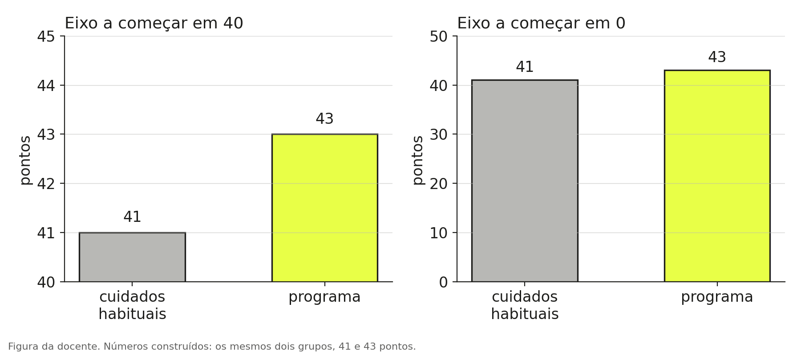
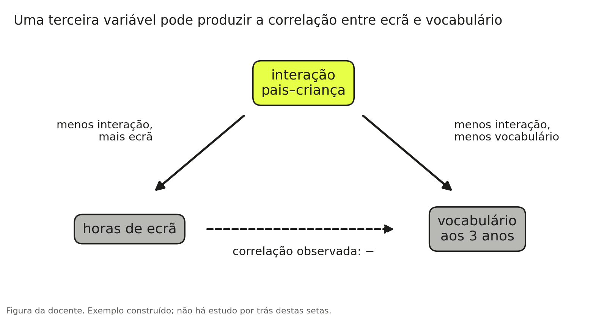
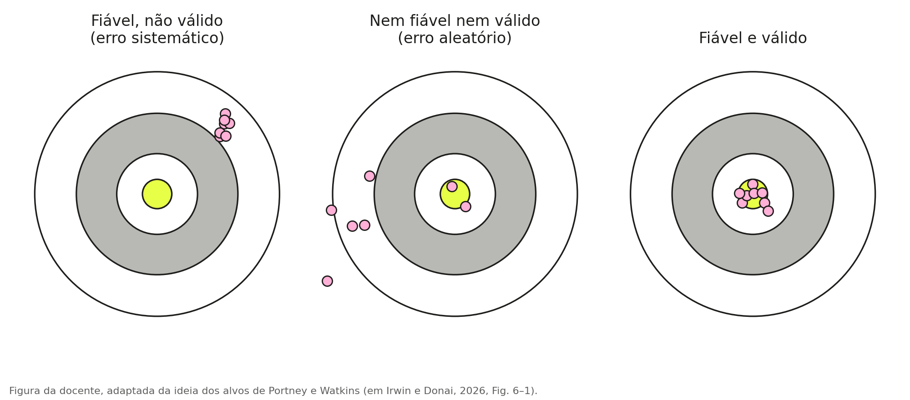
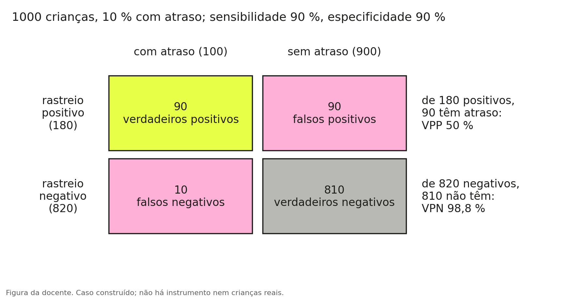

# O que é o [21,6]{.hl} em "38,9 ± 21,6"?

O estudo é um ensaio controlado, não aleatorizado, com 36 crianças em idade pré-escolar com dificuldades na pragmática, isto é, no uso da linguagem em situações sociais [@pereira2025]. As crianças tinham perturbação do espetro do autismo (PEA) ou perturbação do desenvolvimento da linguagem (PDL). Vinte e duas ficaram no grupo experimental, que fez 24 sessões de um programa de intervenção com uma terapeuta da fala, e catorze ficaram em lista de espera, como grupo de controlo. Quase todos os artigos sobre intervenções começam por uma tabela que descreve os participantes antes de a intervenção começar, a que se costuma chamar Tabela 1. A leitura que se segue é a que fazemos na aula.

::: {.fio}
::: {.msg}

O artigo

::: {.clip}
Grupo de controlo (n = 14) e grupo experimental (n = 22), antes da intervenção.

Sexo masculino: [8 (57,1)]{.mk} e 16 (72,7)

TL-ALPE: [38,9 ± 21,6]{.mk .p} e 41,0 ± 27,8
Pereira et al. (2025), Autism, 29(3), duas linhas da Tabela 1, p. 732
:::
:::
::: {.msg .turma}

A turma, no quadro (exemplo)

57,1 é a percentagem de rapazes. De quantos?
o 21,6 é a margem de erro
38,9 mais ou menos 21,6: as crianças estão entre 17 e 60
TL-ALPE é um teste?
:::
::: {.msg}

A explicação

::: {.jm}
antes de leres o resultado de um estudo, lê como foram formados os grupos e como eram as pessoas à partida. É aí que se decide o que a conclusão pode dizer.
:::
As duas linhas têm formas diferentes porque descrevem coisas de tipos diferentes. O sexo é uma categoria: conta-se quantas crianças há em cada uma e faz-se a percentagem. A pontuação num teste de linguagem (o TL-ALPE é um teste de linguagem para crianças portuguesas em idade pré-escolar) é uma quantidade: resume-se com a média e com um segundo número, o desvio-padrão, que é o 21,6. Vemos primeiro as percentagens e depois o desvio-padrão.
:::
:::

## Uma percentagem lê-se com o número de pessoas ao lado

"8 (57,1)" quer dizer oito rapazes, que são 57,1 % do grupo de controlo. O grupo tem catorze crianças, e oito em catorze são 57,1 %. No grupo experimental, "16 (72,7)" são dezasseis rapazes em vinte e duas crianças.

A percentagem sozinha não chega. Um resultado de "33 % dos utentes melhoraram" pode ser um utente em três, e com três pessoas uma só muda tudo: se esse utente não tivesse melhorado, o resultado seria 0 %. O exemplo é adaptado de @rubin2010 [p. 6]. Quando leres uma percentagem, procura sempre de quantos.

## A média e o desvio-padrão

Em "38,9 ± 21,6", o primeiro número é a média das catorze crianças do grupo de controlo no teste de linguagem. O segundo é o desvio-padrão.

::: {.nums}

38,9<small>média do grupo no teste</small>

21,6<small>desvio-padrão: quanto as crianças variam</small>

:::

O desvio-padrão é a distância típica entre cada criança e a média do grupo. Diz quão espalhadas estão as pontuações. Neste grupo, uma criança com 17 pontos e outra com 60 estão, cada uma, a cerca de um desvio-padrão da média, uma abaixo e outra acima, e nenhuma das duas é invulgar no grupo.

Quando o desvio-padrão é pequeno em comparação com a média, as crianças são parecidas umas com as outras e a média descreve bem cada uma. Quando é grande, como aqui, em que é mais de metade da média, o grupo é heterogéneo e a média descreve mal cada criança. Nas cinco crianças do [capítulo 1](01-ler-um-resultado.qmd), a média das reduções era 20 % e o desvio-padrão era de 44,7 pontos percentuais: era a variação que a frase "em média diminuíram 20 %" não mostrava.

O desvio-padrão descreve as pessoas. Não é uma margem de erro, nem é o intervalo de confiança, que descreve a incerteza de um resultado e aparece no [capítulo 3](03-o-valor-p.qmd). E as crianças do grupo não estão todas "entre 17 e 60": se as pontuações tiverem a forma habitual, com muitas crianças perto da média e poucas longe, cerca de dois terços ficam a menos de um desvio-padrão da média, e as restantes ficam mais longe.

::: {.quiz data-certa="2"}

Q2.1 Dois grupos têm a mesma média num teste, 40 pontos. No grupo A o desvio-padrão é 5; no grupo B é 25. O que é que isto diz?

<label><input type="radio" name="q21" value="1"> o grupo B tem melhores resultados</label>
<label><input type="radio" name="q21" value="2"> no grupo A as crianças são parecidas umas com as outras; no grupo B há crianças com pontuações muito baixas e muito altas</label>
<label><input type="radio" name="q21" value="3"> o resultado do grupo B tem mais erro</label>
<button type="button">Verificar</button> 

O desvio-padrão descreve quanto as pessoas variam à volta da média. Não diz que um grupo é melhor, e não mede o erro do estudo.

:::

## O tipo de medida decide o que se pode calcular

O sexo aparece com contagem e percentagem, e o teste de linguagem com média e desvio-padrão, porque são medidas de níveis diferentes [@irwin2026, pp. 123–126].

| Nível de medida | O que é | Exemplos | Como se resume |
|---|---|---|---|
| Nominal | Categorias sem ordem | Sexo, diagnóstico, sim ou não | Contagem e percentagem |
| Ordinal | Categorias com ordem, sem distâncias iguais entre elas | Gravidade ligeira, moderada, grave | Contagem e percentagem; mediana |
| Intervalar e de razão | Quantidades com distâncias iguais | Pontos de um teste, idade em meses | Média e desvio-padrão; ou mediana |

Não se faz a média de categorias. A média de uma escala ordinal é discutível, porque a distância entre "ligeiro" e "moderado" não é necessariamente igual à distância entre "moderado" e "grave". Quando uma quantidade tem valores muito afastados dos outros, ou quando a maior parte das pessoas está de um dos lados, a mediana descreve melhor o grupo do que a média, e costuma vir acompanhada da amplitude interquartil: o intervalo entre o valor que deixa um quarto das pessoas abaixo e o que deixa um quarto acima.

## Como ler uma Tabela 1

Quatro perguntas, por esta ordem. Quantas pessoas há em cada grupo. Quem são: idade, sexo, diagnóstico, cada característica com o número e a percentagem. Como estavam antes da intervenção em cada medida: média e desvio-padrão, ou mediana e amplitude interquartil. E o que a tabela não mostra e fazia falta.

Na tabela deste artigo, os dois grupos tinham idades quase iguais (54,2 e 53,9 meses, em média) e pontuações parecidas no teste de linguagem (38,9 e 41,0), com desvios-padrão grandes nos dois. Os grupos não tinham o mesmo tamanho: catorze e vinte e duas crianças.

## Desconfiar do gráfico: onde começa o eixo

{fig-alt="Dois gráficos de barras com os valores 41 e 43. No da esquerda o eixo vertical começa em 40 e a segunda barra parece o triplo da primeira. No da direita o eixo começa em 0 e as duas barras são quase iguais." width=100%}

Os dois gráficos mostram os mesmos números. No da esquerda o eixo começa em 40, e a barra do programa parece muito maior do que a outra. No da direita o eixo começa em zero, e a diferença de 2 pontos vê-se com o tamanho que tem. Quando uma barra representa uma quantidade, o eixo começa em zero. Quando não pode começar em zero, como numa pontuação padronizada cuja média é 100, o gráfico deve mostrar a escala e o leitor deve olhar para ela antes de olhar para as barras.

## Duas coisas que variam juntas: correlação e causa

Uma notícia construída para este capítulo: "Estudo com 400 crianças: as que passam mais de duas horas por dia ao ecrã têm menos vocabulário aos 3 anos."

O estudo descreve uma correlação: nas 400 crianças, as duas medidas variam juntas. Isso não chega para dizer que o ecrã causa a falta de vocabulário, por duas razões.

{fig-alt="Diagrama com três caixas. Da caixa interação pais-criança saem duas setas: uma para horas de ecrã e outra para vocabulário aos 3 anos. Entre ecrã e vocabulário há uma seta a tracejado que representa a correlação observada." width=90%}

A primeira é uma terceira variável. Pais que interagem menos com a criança podem deixá-la mais tempo ao ecrã e, ao mesmo tempo, falar-lhe menos. A interação produz as duas coisas, e o ecrã e o vocabulário aparecem ligados sem que um cause o outro. A isto chama-se confundimento.

A segunda é a direção. Uma criança com menos linguagem pode ser posta mais vezes ao ecrã. Nesse caso é a linguagem que influencia o ecrã.

Outra notícia construída: "As 20 crianças que fizeram o programa ganharam em média 12 pontos em seis meses." Aqui falta com quem comparar. Em seis meses, crianças de 3 e 4 anos ganham pontos de linguagem sem programa nenhum: crescem, vão ao jardim de infância, falam mais. Para saber quanto dos 12 pontos é do programa, é preciso um grupo parecido que não o fez, e ver quanto esse grupo ganhou no mesmo tempo.

### O que a distribuição ao acaso garante

Ter um grupo de comparação não chega; os dois grupos têm de ser parecidos antes da intervenção, também naquilo que ninguém mediu: a motivação dos pais, a escolaridade, o que cada família faz em casa. A única maneira de o conseguir é distribuir as pessoas pelos grupos ao acaso, porque assim nenhuma característica vai sistematicamente mais para um grupo do que para o outro [@ferreira2016]. As diferenças que sobram entre os grupos são só as do acaso, e é delas que tratam o intervalo de confiança e o valor p do [capítulo 3](03-o-valor-p.qmd). Só funciona se ninguém escolher quem vai para onde.

No estudo deste capítulo houve grupo de controlo, e as crianças não foram distribuídas ao acaso. Os resultados são mais fortes do que os da notícia das 20 crianças, e menos do que seriam num ensaio aleatorizado. Os autores escrevem-no nas limitações: as crianças não foram distribuídas aleatoriamente, e os pais e os educadores, que responderam a duas das medidas, sabiam em que grupo a criança estava, o que pode ter influenciado as respostas [@pereira2025, p. 736]. No estudo do [capítulo 1](01-ler-um-resultado.qmd) houve sorteio, e por isso a diferença de 5,3 pontos pode atribuir-se à intervenção, com a incerteza que o intervalo mostra.

::: {.def}
A palavra "causa" depende do desenho do estudo. Uma correlação entre duas medidas não permite dizer que uma causa a outra. Uma melhoria entre o antes e o depois, sem grupo de comparação, não permite dizer que foi a intervenção. A distribuição ao acaso por dois grupos é o desenho que permite atribuir a diferença à intervenção.
:::

::: {.quiz data-certa="3"}

Q2.2 "As crianças que frequentaram terapia da fala em grupo tiveram melhores resultados do que as que frequentaram terapia individual. As famílias escolheram a modalidade." Pode concluir-se que a terapia em grupo é melhor?

<label><input type="radio" name="q22" value="1"> sim, porque há dois grupos</label>
<label><input type="radio" name="q22" value="2"> sim, se a diferença for grande</label>
<label><input type="radio" name="q22" value="3"> não: as famílias que escolheram uma modalidade podem ser diferentes das que escolheram a outra, e a diferença pode vir daí</label>
<button type="button">Verificar</button> 

Há grupo de comparação, mas foram as famílias a escolher. As crianças com dificuldades mais ligeiras podem ter ido mais para o grupo, por exemplo. O tamanho da diferença não resolve o problema; só a distribuição ao acaso o resolve.

:::

## Desconfiar do instrumento: fiabilidade e validade

Os números de um estudo vêm de instrumentos: testes, escalas, questionários. Um instrumento tem duas qualidades diferentes [@irwin2026, pp. 127–131].

A fiabilidade é a consistência: o instrumento dá o mesmo resultado quando se repete a medida, quando muda o avaliador e quando se comparam os itens entre si. A validade é medir aquilo que se diz medir. São qualidades diferentes, e um instrumento pode ser fiável sem ser válido. Uma balança que marca sempre dois quilos a mais é fiável e não é válida.

{fig-alt="Três alvos. No primeiro os pontos estão juntos e longe do centro: fiável, não válido. No segundo estão espalhados: nem fiável nem válido. No terceiro estão juntos no centro: fiável e válido." width=100%}

Os artigos indicam a fiabilidade dos instrumentos com coeficientes que vão de 0 a 1, ou com percentagens de acordo; quanto mais perto de 1, ou de 100 %, mais consistente é a medida. No estudo deste capítulo foram usados o TL-ALPE e a EAC, uma escala de competências comunicativas preenchida pelos pais e pelos educadores [@pereira2025, p. 731]:

| O que o coeficiente mede | Como se chama | Valores no artigo |
|---|---|---|
| Os itens concordam entre si | Consistência interna (alfa de Cronbach) | 0,929 na escala EAC; 0,825 a 0,951 no TL-ALPE |
| A mesma criança, avaliada duas vezes, dá o mesmo resultado | Teste-reteste | 0,943 a 1,000 na escala EAC |
| Dois avaliadores dão a mesma pontuação | Acordo entre avaliadores | 95,2 % no TL-ALPE |

Estes números garantem consistência de três tipos. Nenhum garante que a escala mede o que diz medir; isso é a validade, que se estuda de outras maneiras: vendo se os itens cobrem tudo o que se quer medir (validade de conteúdo), se as pontuações concordam com as de um teste já estabelecido ou preveem o que acontece mais tarde (validade de critério), e se se comportam como a teoria diz, por exemplo subindo com a idade e distinguindo crianças com e sem perturbação (validade de constructo).

No mesmo artigo, a escala EAC foi preenchida pelos pais e pelos educadores de cada criança. Antes da intervenção, a correlação entre as respostas de uns e de outros era de 0,635. O coeficiente de correlação vai de −1 a 1: zero quer dizer que não há relação e 1 que a relação é perfeita. Pais e educadores concordavam só em parte, porque veem a criança em contextos diferentes ou reparam em coisas diferentes.

## Um rastreio que "acerta 90 %"

O caso é construído. Um rastreio de linguagem é aplicado a 1000 crianças de 3 anos, das quais 100 têm atraso de linguagem. Diz-se que o rastreio "acerta 90 %", e isso são duas coisas [@irwin2026, pp. 247–249].

A sensibilidade é a proporção das crianças com atraso a quem o rastreio dá positivo: 90 em 100. Falha 10. A especificidade é a proporção das crianças sem atraso a quem o rastreio dá negativo: 810 em 900. Dá positivo, por engano, a 90.

{fig-alt="Tabela de dupla entrada. Rastreio positivo: 90 crianças com atraso, verdadeiros positivos, e 90 sem atraso, falsos positivos. Rastreio negativo: 10 com atraso, falsos negativos, e 810 sem atraso, verdadeiros negativos." width=90%}

Agora a pergunta que interessa à família: a criança teve resultado positivo; qual é a probabilidade de ter mesmo atraso? Tiveram resultado positivo 180 crianças, e só 90 delas têm atraso. É metade. A este número chama-se valor preditivo positivo: 90 em 180, ou 50 %.

Se o mesmo rastreio for usado onde só 2 % das crianças têm atraso, em 1000 crianças há 20 com atraso, das quais 18 têm resultado positivo, e 980 sem atraso, das quais 98 têm resultado positivo por engano. O valor preditivo positivo passa a ser 18 em 116, ou 15,5 %. O teste é o mesmo, mas a frequência do atraso na população é outra.

| Medida | Como se calcula |
|---|---|
| Sensibilidade | verdadeiros positivos a dividir por todos os que têm o problema |
| Especificidade | verdadeiros negativos a dividir por todos os que não têm o problema |
| Valor preditivo positivo | verdadeiros positivos a dividir por todos os resultados positivos |
| Valor preditivo negativo | verdadeiros negativos a dividir por todos os resultados negativos |

::: {.def}
A sensibilidade e a especificidade são características do teste. O valor preditivo depende também da frequência do problema na população em que o teste é usado, e é ele que responde à pessoa que recebe o resultado. Um resultado positivo num rastreio pede uma avaliação completa; não é um diagnóstico.
:::

::: {.quiz data-certa="2"}

Q2.3 Um rastreio tem sensibilidade de 90 % e especificidade de 90 %. Numa população em que 10 % das crianças têm atraso, de cada 100 crianças com resultado positivo, quantas têm mesmo atraso?

<label><input type="radio" name="q23" value="1"> 90</label>
<label><input type="radio" name="q23" value="2"> 50</label>
<label><input type="radio" name="q23" value="3"> 10</label>
<button type="button">Verificar</button> 

Em 1000 crianças, o rastreio dá positivo a 90 das 100 com atraso e, por engano, a 90 das 900 sem atraso. São 180 resultados positivos, e só metade (90) são de crianças com atraso.

:::

Uma nota sobre as pontuações de idade equivalente, que aparecem em muitos relatórios. Uma idade equivalente diz a idade em que aquela pontuação é típica. Não diz onde a criança está em relação às crianças da sua idade, nem quanto é habitual variar. Haynes e Pindzola, citados por @irwin2026 [p. 249], chamam-lhes "the least useful and most dangerous scores to be obtained from standardized tests". Para decidir se uma criança está abaixo do esperado usam-se pontuações padronizadas.

## O que fica

Uma percentagem lê-se com o número de pessoas ao lado, e uma média com o desvio-padrão ao lado.

A palavra "causa" vem do desenho do estudo: sem grupo de comparação, ou sem distribuição ao acaso, a conclusão tem de ser mais modesta.

A sensibilidade e a especificidade de um rastreio não dizem quantas crianças com resultado positivo têm mesmo o problema; isso é o valor preditivo, que muda com a população.

## Exercícios

1. Na Tabela 1 do artigo deste capítulo, a linha da idade, em meses, diz "54.2 ± 9.0" para o grupo de controlo e "53.9 ± 7.6" para o grupo experimental [@pereira2025, p. 732]. O que é cada número? Uma criança de 45 meses é invulgar no grupo de controlo?

::: {.callout-note collapse="true" title="Resposta"}
54,2 e 53,9 são as médias de idade dos dois grupos, em meses; 9,0 e 7,6 são os desvios-padrão. Uma criança de 45 meses está a cerca de um desvio-padrão abaixo da média do grupo de controlo (54,2 − 9,0 = 45,2), e por isso não é invulgar.
:::

2. Caso construído. Um rastreio tem sensibilidade de 80 % e especificidade de 95 %. É aplicado a 2000 crianças, das quais 100 têm atraso de linguagem. Quantas crianças têm resultado positivo, e quantas dessas têm mesmo atraso?

::: {.callout-note collapse="true" title="Resposta"}
Das 100 com atraso, o rastreio dá positivo a 80. Das 1900 sem atraso, dá negativo a 95 %, isto é, a 1805, e positivo por engano a 95. Há 175 resultados positivos, e 80 são de crianças com atraso: o valor preditivo positivo é 80 em 175, cerca de 46 %.
:::

3. "Num inquérito a pais, as crianças que dormem menos horas têm mais dificuldades de atenção na escola." Escreve duas explicações para este resultado que não sejam "dormir pouco causa dificuldades de atenção".

::: {.callout-note collapse="true" title="Resposta"}
Por exemplo: uma terceira variável, como a rotina da família ou a ansiedade da criança, pode produzir as duas coisas; ou a direção pode ser a contrária, com as crianças que têm mais dificuldades de atenção a adormecerem mais tarde. O inquérito mostra que as duas coisas variam juntas e não permite escolher entre estas explicações.
:::

## Para ler mais

@irwin2026: pp. 123–131 sobre níveis de medida, validade e fiabilidade; pp. 157–164 sobre estatística descritiva; pp. 247–249 sobre sensibilidade, especificidade e valores preditivos. @ferreira2016 explicam num texto curto, em português e em inglês, o que a aleatorização garante. O artigo deste capítulo é @pereira2025.
