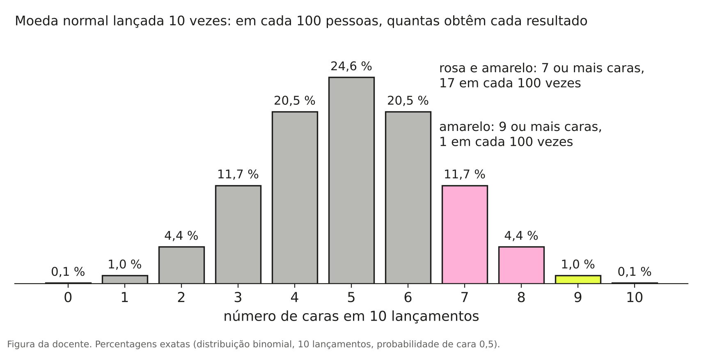
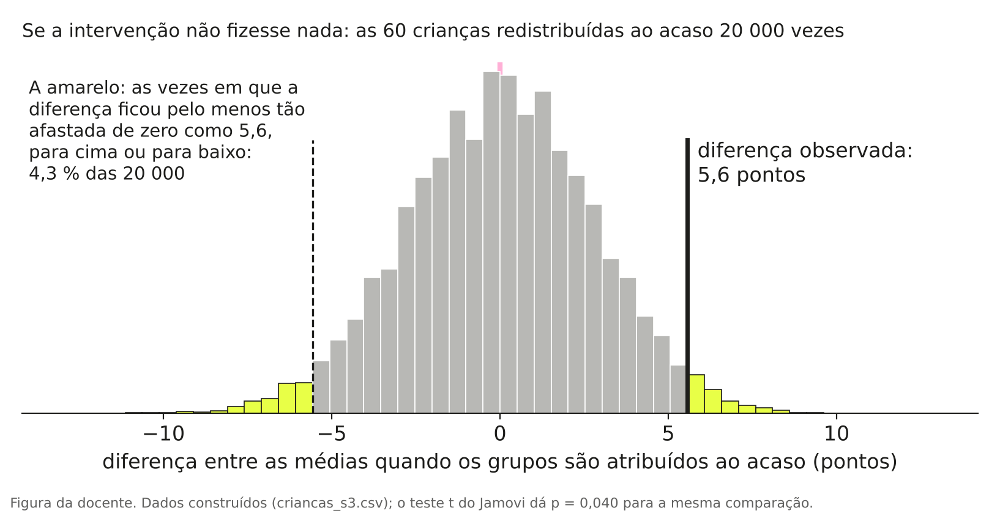
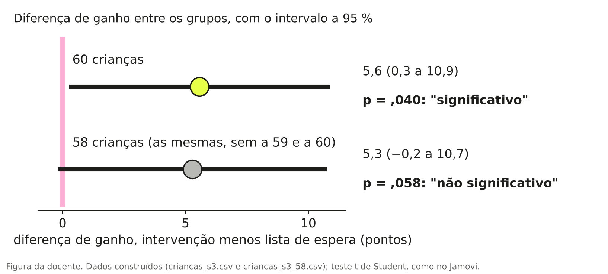
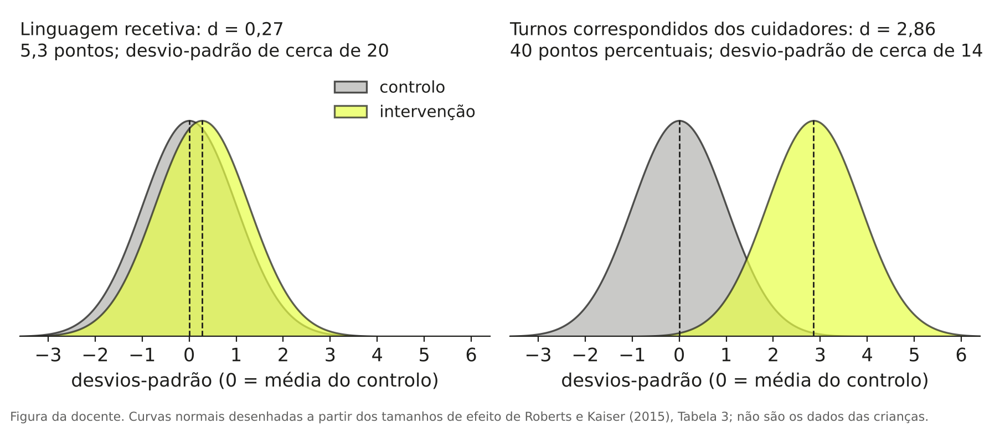
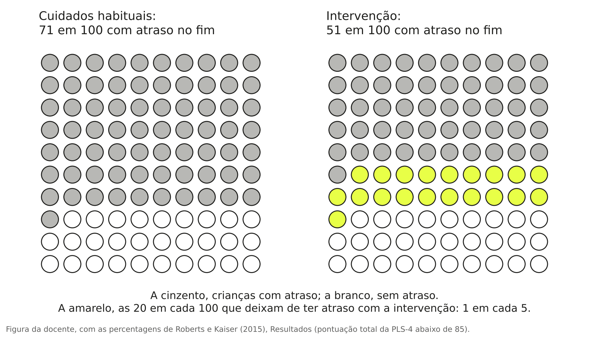

# O que quer dizer [p &lt; ,01]{.hl}?

O estudo é o do capítulo 1: um ensaio aleatorizado com 97 crianças de 24 a 42 meses com atraso de linguagem, em que uma intervenção ensinada aos pais durante três meses foi comparada com os cuidados habituais [@roberts2015]. No capítulo 1 lemos os números da frase de resultados. Ficaram por ler o intervalo de confiança, o valor p e a palavra "significativamente". A leitura que se segue é a que fazemos na aula, e começa com uma moeda.

::: {.fio}
::: {.msg}

O artigo

::: {.clip}
Os cuidadores melhoraram o uso de todas as estratégias de facilitação da linguagem, como os turnos correspondidos (diferença média ajustada, intervenção menos controlo, 40; intervalo de confiança a 95 % de 34 a 46; [p < ,01]{.mk}). As crianças do grupo de intervenção tiveram competências de linguagem recetiva [significativamente]{.mk .p} melhores (5,3; intervalo de confiança a 95 % de 0,15 a 10,4), mas não de linguagem expressiva (0,37; −4,5 a 5,3; [p = ,88]{.mk}).
Roberts & Kaiser (2015), Pediatrics, 135(4), resumo, secção Results; tradução da docente
:::
:::
::: {.msg .turma}

A turma, no quadro (exemplo)

p é de probabilidade?
probabilidade de quê?
menos de 1 % de hipótese de estar errado
significativamente quer dizer muito melhores
34 a 46 é um intervalo de quê?
:::
::: {.msg}

A explicação

::: {.jm}
o valor p percebe-se melhor com uma moeda na mão do que com uma definição. Lança-a mesmo; demora um minuto.
:::
Para ler o que falta na frase é preciso uma ideia que não está no artigo: o que o acaso produz sozinho, sem intervenção nenhuma. Essa ideia vê-se com uma moeda, e por isso o capítulo começa por aí e só depois volta às crianças.

Este capítulo é mais longo do que os dois anteriores e não pede nenhum conhecimento de estatística. Pode ler-se em três vezes: primeiro a moeda e o intervalo de confiança; depois o valor p e a palavra "significativo"; por fim o tamanho do efeito, os resultados não significativos e os testes.
:::
:::

## Uma moeda lançada dez vezes

Antes de leres mais, decide. Alguém lança uma moeda 10 vezes e saem 7 caras. Desconfias da moeda? E se saírem 9 caras?

Agora pega numa moeda, lança-a 10 vezes e conta as caras. Se puderes, repete a série de 10 lançamentos mais quatro ou cinco vezes, ou pede a outras pessoas que façam o mesmo, e aponta o número de caras de cada série.

Os números não saem todos iguais, e a moeda é sempre a mesma. A figura mostra o que acontece quando muita gente faz esta experiência com moedas normais, isto é, moedas em que cara e coroa têm a mesma probabilidade.

{fig-alt="Gráfico de barras com o número de caras em 10 lançamentos, de 0 a 10. Cinco caras saem em 24,6 por cento das vezes; quatro ou seis caras em 20,5 por cento cada; três ou sete em 11,7 por cento cada; duas ou oito em 4,4 por cento cada; uma ou nove em 1,0 por cento cada; zero ou dez em 0,1 por cento cada. As barras de sete ou mais caras estão destacadas e somam 17 por cento; as de nove ou mais somam 1 por cento." width=100%}

A figura mostra duas coisas, e o resto do capítulo sai delas.

A primeira é que o resultado varia de pessoa para pessoa, embora as moedas sejam todas iguais. Quem teve 3 caras e quem teve 7 lançou o mesmo tipo de moeda, e nenhum dos dois se enganou a contar. Um resultado sozinho dá uma ideia aproximada do que a moeda faz, com alguma margem de erro. Desta ideia sai o intervalo de confiança.

A segunda é que alguns resultados são comuns e outros são raros. Com uma moeda normal, 4, 5 ou 6 caras saem em cerca de dois terços das vezes. Sete ou mais caras saem em 17 de cada 100 vezes. Nove ou mais caras saem em 1 de cada 100 vezes. Desta ideia sai o valor p.

Com isto responde-se às duas perguntas do início. Sete caras em 10 acontecem muitas vezes só por acaso, e não chegam para desconfiar da moeda. Nove caras em 10 são raras: ou a pessoa teve muita sorte, ou a moeda não é normal.

O raciocínio foi o seguinte. Não sabemos se a moeda está viciada. Perguntamos quantas vezes uma moeda normal daria tantas caras como as que saíram, ou ainda mais. Se a resposta for "quase nunca", desconfiamos da moeda. Convém lembrar que "raro" não quer dizer "impossível": numa sala com 25 pessoas, cada uma a lançar a sua moeda 10 vezes, há cerca de uma hipótese em quatro de alguém ter 9 ou 10 caras com uma moeda normal.

::: {.quiz data-certa="1"}

Q3.1 Lanças uma moeda 10 vezes e saem 8 caras. Com uma moeda normal, 8 ou mais caras saem em cerca de 5 de cada 100 vezes. O que podes dizer?

<label><input type="radio" name="q31" value="1"> um resultado assim é pouco comum com uma moeda normal, mas acontece: em 100 pessoas a fazer a experiência, espera-se que aconteça a cerca de 5</label>
<label><input type="radio" name="q31" value="2"> a moeda está viciada, com 95 % de certeza</label>
<label><input type="radio" name="q31" value="3"> a moeda é normal, porque 8 caras podem sair por acaso</label>
<button type="button">Verificar</button> 

A conta dos 5 em 100 é feita a supor que a moeda é normal. Diz com que frequência uma moeda normal dá 8 ou mais caras; não diz qual é a probabilidade de a moeda estar viciada, nem prova que é normal.

:::

## O resultado de um estudo é uma estimativa

Se as autoras repetissem o estudo com outras 97 crianças com atraso de linguagem, a diferença na linguagem recetiva não voltava a ser exatamente 5,3. Outras crianças dariam outro número, próximo mas diferente, porque as crianças são diferentes umas das outras. É o que acontece com as moedas: cada série de 10 lançamentos dá o seu número de caras.

As 97 crianças do estudo são a amostra. Todas as crianças com atraso de linguagem a quem a intervenção se podia aplicar são a população. O estudo mede a amostra para dizer alguma coisa sobre a população. O 5,3 é a estimativa que esta amostra dá; o efeito da intervenção na população não se conhece, e só se conheceria estudando todas as crianças. O intervalo de confiança serve para dizer entre que valores esse efeito desconhecido pode estar, tendo em conta que só se estudou uma amostra [@patino2015ic].

A figura seguinte faz com crianças o que fizemos com a moeda. Os números são construídos por computador, e por isso sabemos uma coisa que num estudo real nunca se sabe: o valor verdadeiro. Para simplificar, cada estudo da figura mede o ganho de um só grupo de crianças; com a diferença entre dois grupos passa-se o mesmo.

{fig-alt="Três painéis. À esquerda, um histograma dos ganhos numa população construída, centrado em 5 pontos e com valores de cerca de menos 30 a mais 40. Ao centro, vinte estudos com 10 crianças: as bolas variam entre cerca de menos 2 e mais 16 e as barras são compridas; uma barra, a rosa, não contém o 5. À direita, vinte estudos com 97 crianças: as bolas ficam todas perto de 5 e as barras são curtas; também aqui uma barra, a rosa, não contém o 5." width=100%}

Há três coisas a ver na figura. Com 10 crianças, os resultados variam muito de estudo para estudo, e alguns ficam abaixo de zero, embora o valor verdadeiro seja 5. Com 97 crianças, os resultados ficam todos perto de 5 e as barras são muito mais curtas. E quase todas as barras passam por cima do 5: em cada painel há uma, a rosa, que não passa. Quem fez o estudo da linha rosa não sabe que o seu intervalo falhou; só nós sabemos, porque fomos nós a construir a população.

O tamanho de um intervalo depende de duas coisas. Depende do número de participantes: com mais pessoas, o resultado varia menos de estudo para estudo e o intervalo fica mais pequeno. Com a moeda é igual: em 10 lançamentos é fácil sair 70 % de caras; em 1000 lançamentos isso praticamente nunca acontece. E depende de quanto as pessoas variam entre si naquela medida: quanto mais diferentes forem umas das outras, maior fica o intervalo.

::: {.def}
O intervalo de confiança a 95 % é o conjunto dos valores do efeito verdadeiro que são compatíveis com os dados do estudo. "A 95 %" descreve o método usado para o calcular: em 100 estudos feitos da mesma maneira, cerca de 95 intervalos contêm o valor verdadeiro e 5 não. Na simulação eram 19 em 20.
:::

É frequente ler-se "há 95 % de probabilidade de o valor verdadeiro estar entre 0,15 e 10,4". Em rigor, os 95 % descrevem o que acontece em muitos estudos; um intervalo em particular ou contém o valor verdadeiro ou não contém [@greenland2016]. Para ler artigos chega a leitura "valores compatíveis com os dados".

Com isto, os três intervalos da frase do artigo leem-se assim:

| Resultado | Intervalo a 95 % | Como se lê |
|---|---|---|
| Turnos correspondidos dos pais: 40 pontos percentuais | 34 a 46 | O efeito verdadeiro pode estar entre 34 e 46 pontos percentuais. Todos estes valores são grandes e estão longe de zero. |
| Linguagem recetiva: 5,3 pontos | 0,15 a 10,4 | O efeito verdadeiro pode ser quase nulo (0,15 pontos) ou chegar a 10 pontos. É favorável à intervenção, e o tamanho é incerto. |
| Linguagem expressiva: 0,37 pontos | −4,5 a 5,3 | O efeito verdadeiro pode ser uma perda de 4,5 pontos, pode ser zero e pode ser um ganho de 5,3 pontos. |

: {tbl-colwidths="[30,17,53]"}

O intervalo é sempre à volta da diferença entre os grupos. Não é um intervalo de idades, nem diz entre que valores ficou cada criança. Quando o zero está dentro do intervalo, como na terceira linha, os dados são compatíveis com não haver efeito nenhum.

::: {.quiz data-certa="3"}

Q3.2 Um estudo dá uma diferença de 4 pontos entre os grupos, com intervalo de confiança a 95 % de −1 a 9. Qual é a leitura certa?

<label><input type="radio" name="q32" value="1"> a intervenção não tem efeito, porque o zero está dentro do intervalo</label>
<label><input type="radio" name="q32" value="2"> 95 % das crianças ganharam entre −1 e 9 pontos</label>
<label><input type="radio" name="q32" value="3"> o efeito verdadeiro pode ser uma pequena perda, pode ser zero e pode ser um ganho de até 9 pontos; o estudo não permite escolher</label>
<button type="button">Verificar</button> 

O intervalo diz respeito à diferença entre as médias dos dois grupos, não a cada criança. Ter o zero lá dentro quer dizer que "nenhum efeito" é um dos valores compatíveis com os dados; um ganho de 9 pontos também é.

:::

## Da moeda ao estudo: o valor p

O raciocínio da moeda aplica-se, passo a passo, a um estudo de intervenção. O exemplo de estudo é construído: 60 crianças, 30 num grupo de intervenção e 30 em lista de espera.

| | Na experiência da moeda | Num estudo de intervenção |
|---|---|---|
| O que se supõe | A moeda é normal | A intervenção não faz nada |
| O que se observou | 9 caras em 10 | O grupo de intervenção ficou 5,6 pontos acima do outro |
| A pergunta | Quantas vezes uma moeda normal dá 9 ou mais caras? | Se a intervenção não fizesse nada, quantas vezes apareceria uma diferença de 5,6 pontos ou mais? |
| A resposta | Em 1 de cada 100 vezes | É o valor p |

: {tbl-colwidths="[20,35,45]"}

À suposição "a intervenção não faz nada" os artigos chamam hipótese nula. A conta do valor p é sempre feita a supor que a hipótese nula é verdadeira [@ferreira2015p].

### Porque há diferenças entre grupos mesmo sem intervenção

As crianças são diferentes umas das outras. Em três meses, umas evoluem muito, outras pouco, e algumas pioram. Se 60 crianças forem divididas ao acaso em dois grupos de 30 e ninguém fizer nada a nenhum dos grupos, as médias dos dois grupos não ficam exatamente iguais: a um dos grupos calham, por acaso, mais crianças das que evoluem depressa. Com as moedas passou-se o mesmo: a uma pessoa saíram 7 caras e a outra 4, sem que nenhuma moeda fosse diferente.

Por isso, quando um estudo encontra uma diferença entre os grupos, a primeira pergunta a fazer é se essa diferença é maior do que as que o acaso produz sozinho.

Para responder, pode fazer-se com as crianças o que se fez com a moeda. No exemplo construído, o grupo de intervenção ganhou em média mais 5,6 pontos do que a lista de espera. Pegou-se nos ganhos das 60 crianças e ignorou-se quem recebeu a intervenção. Dividiram-se as 60 ao acaso em dois grupos de 30 e calculou-se a diferença entre as médias. Repetiu-se isto 20 000 vezes.

{fig-alt="Histograma das diferenças entre as médias de dois grupos formados ao acaso, centrado em zero e com quase todos os valores entre menos 8 e mais 8 pontos. Uma linha preta vertical marca a diferença observada, 5,6 pontos. As barras a amarelo, para lá de 5,6 e para lá de menos 5,6, são 4,3 por cento das 20 000 divisões." width=100%}

Quase todas as divisões ao acaso dão diferenças perto de zero, tal como quase todas as séries de 10 lançamentos dão perto de 5 caras. A amarelo estão as vezes em que o acaso sozinho deu uma diferença de 5,6 pontos ou mais, para qualquer dos lados: 4,3 % das vezes, cerca de 4 em cada 100. Com a moeda contámos só o lado das caras; nos estudos conta-se para os dois lados, porque o grupo de intervenção tanto pode ficar acima como abaixo do outro. Este número é o valor p do estudo construído: ,04. Um programa de estatística chega a ,040 por uma fórmula, sem precisar de dividir as crianças 20 000 vezes.

::: {.def}
O valor p responde a esta pergunta: se a intervenção não fizesse nada, com que frequência apareceria uma diferença pelo menos tão grande como a que o estudo encontrou? Um p pequeno diz que o resultado é difícil de explicar só pelo acaso. Um p grande diz que o acaso chega para o explicar.
:::

### Como se lê um valor p

O valor p escreve-se como uma proporção. p = ,04 são 4 em cada 100 vezes; p = ,01 é 1 em cada 100; p = ,88 são 88 em cada 100. "p < ,01" quer dizer menos de 1 em cada 100. Nos artigos em inglês aparece com ponto (p = .04 ou p = 0.04), e muitos artigos e programas escrevem o zero antes da vírgula (0,04); é o mesmo número. Neste capítulo, quando se cita um artigo ou um programa, o valor fica como lá está.

Com a moeda, e contando só o lado das caras: 9 ou mais caras em 10 têm p = ,01; 7 ou mais caras têm p = ,17.

A frase do artigo tem dois valores p, e a Tabela 3 do artigo dá o terceiro, que o resumo substituiu pela palavra "significativamente":

Turnos correspondidos, p < ,01. Se a intervenção não mudasse o comportamento dos pais, uma diferença de 40 pontos percentuais ou mais apareceria em menos de 1 em cada 100 estudos como este. É difícil de explicar só pelo acaso.

Linguagem recetiva, p = ,04. Se a intervenção não fizesse nada, uma diferença de 5,3 pontos ou mais apareceria em 4 de cada 100 estudos.

Linguagem expressiva, p = ,88. Se a intervenção não fizesse nada, uma diferença de 0,37 pontos ou mais apareceria em 88 de cada 100 estudos. É o tipo de diferença que o acaso produz quase sempre, como as 5 caras em 10.

Os valores p e os intervalos concordam: o p mais pequeno é o do intervalo mais afastado do zero, e o p maior é o do intervalo que tem o zero lá dentro.

::: {.quiz data-certa="2"}

Q3.3 Um estudo compara dois grupos e dá p = ,03. O que quer isto dizer?

<label><input type="radio" name="q33" value="1"> há 3 % de probabilidade de a intervenção não funcionar</label>
<label><input type="radio" name="q33" value="2"> se a intervenção não fizesse nada, uma diferença pelo menos tão grande como a encontrada apareceria em 3 de cada 100 estudos como este</label>
<label><input type="radio" name="q33" value="3"> a intervenção melhorou os resultados em 3 %</label>
<button type="button">Verificar</button> 

O p é calculado a supor que a intervenção não faz nada, e por isso não pode ser a probabilidade de ela funcionar ou não. Também não mede o tamanho da melhoria; esse lê-se na diferença entre os grupos.

:::

### O que o valor p não diz

Há três leituras do valor p que aparecem muitas vezes e que estão erradas [@greenland2016].

| Costuma dizer-se | O que o valor p diz de facto |
|---|---|
| "p = ,01: há 99 % de certeza de que a intervenção funciona" | O p é calculado a supor que a intervenção não faz nada. Diz que um resultado assim seria raro nesse caso; não dá a probabilidade de a intervenção funcionar. |
| "p muito pequeno: o efeito é muito grande" | O p não mede o tamanho do efeito. Um efeito pequeno, num estudo com muita gente, dá um p muito pequeno. |
| "p grande: a intervenção não funciona" | Um p grande só diz que o acaso chega para explicar o resultado. Um estudo com poucas pessoas pode não detetar um efeito que existe. |

: {tbl-colwidths="[38,62]"}

A primeira vê-se bem com a moeda. Nove caras em 10 não dizem que há 99 % de probabilidade de a moeda estar viciada: se a moeda saiu do teu bolso, continuas a achar que é normal e que tiveste sorte. @ferreira2015p dão um exemplo com um medicamento, em que a diferença entre dois grupos tem p = ,03, e escrevem: "Isso não significa que a droga seja um diurético, nem que haja uma chance de 97% de a droga ser diurética." A segunda e a terceira leituras são o assunto das secções seguintes.

## "Estatisticamente significativo" é uma convenção

"Estatisticamente significativo" quer dizer que o valor p ficou abaixo de um limite escolhido antes do estudo. Por tradição, esse limite é ,05, isto é, 5 em cada 100 [@ferreira2015p]. Com p abaixo de ,05 os investigadores escrevem "diferença significativa"; com p acima, "diferença não significativa".

Com a moeda: 8 ou mais caras em 10 saem em 5,5 de cada 100 vezes, um pouco acima do limite, e 9 ou mais saem em 1 de cada 100. Pela convenção, com 8 caras ainda não se desconfia da moeda, e com 9 já se desconfia.

Na frase do artigo, "significativamente melhores" quer dizer só isto: na linguagem recetiva, o p ficou abaixo de ,05 (foi ,04). A palavra descreve o resultado de um teste. Não descreve o tamanho nem a importância da diferença.

O limite de ,05 não separa dois tipos de resultados. No exemplo construído das 60 crianças, a diferença entre os grupos é de 5,6 pontos, com p = ,040. Se retirarmos duas crianças do ficheiro, uma de cada grupo, a diferença passa a 5,3 pontos, com p = ,058.

{fig-alt="Dois intervalos de confiança, um por cima do outro. Com 60 crianças: diferença de 5,6 pontos, intervalo de 0,3 a 10,9, p igual a 0,040, significativo. Com 58 crianças: diferença de 5,3 pontos, intervalo de menos 0,2 a 10,7, p igual a 0,058, não significativo. Uma linha rosa vertical marca o zero." width=100%}

O primeiro resultado é "significativo" e o segundo "não significativo", e os dois dizem quase o mesmo: a diferença estimada é de cerca de 5 pontos, e o efeito verdadeiro pode estar entre quase zero e cerca de 11. As duas crianças retiradas não eram casos extremos. Por isso se lê sempre a diferença e o intervalo, e não só a palavra.

::: {.quiz data-certa="1"}

Q3.4 Dois estudos avaliam a mesma intervenção. Estudo A: diferença de 5,6 pontos (intervalo de 0,3 a 10,9), p = ,040. Estudo B: diferença de 5,3 pontos (intervalo de −0,2 a 10,7), p = ,058. Qual é a leitura mais sensata?

<label><input type="radio" name="q34" value="1"> os dois estudos encontraram quase o mesmo: uma diferença de cerca de 5 pontos, com um efeito verdadeiro que pode ir de quase zero a cerca de 11</label>
<label><input type="radio" name="q34" value="2"> o estudo A mostra que a intervenção funciona e o estudo B mostra que não funciona</label>
<label><input type="radio" name="q34" value="3"> o estudo B está errado, porque contradiz o estudo A</label>
<button type="button">Verificar</button> 

Os dois resultados só diferem no lado do ,05 em que o p ficou. As diferenças e os intervalos são quase iguais, e é por eles que se compara.

:::

### Significativo não quer dizer importante

Num estudo com mais de 22 000 pessoas seguidas durante cinco anos, em média, a aspirina reduziu os enfartes do miocárdio com p < ,00001. A diferença de risco foi de 0,77 %: menos de um enfarte evitado por cada 100 pessoas tratadas [@sullivan2012].

O p foi muito pequeno porque o estudo era muito grande, e o efeito era muito pequeno. Com a moeda, seria uma moeda que dá cara 51 % das vezes: em 10 lançamentos ninguém dá por isso; em 100 000 lançamentos o p é minúsculo, e a moeda continua a ser quase normal.

O valor p diz se o acaso chega para explicar o resultado. Para saber se o resultado é grande ou pequeno, olha-se para a diferença e para o seu intervalo.

## O tamanho do efeito

No capítulo 1 ficou uma pergunta por responder: 5,3 é muito? O tamanho de um efeito pode dizer-se de duas maneiras.

A primeira é na unidade em que foi medido: a diferença entre os grupos, tal como está no artigo. Por exemplo, 5,3 pontos da PLS-4. Para saber se é muito, é preciso conhecer a escala.

A segunda é em desvios-padrão: divide-se a diferença pelo desvio-padrão e fica-se a saber a quantos desvios-padrão ela corresponde. A este número chama-se d de Cohen. A Tabela 3 do artigo dá d = 0,27 para a linguagem recetiva, 0,03 para a expressiva e 2,86 para os turnos correspondidos. Um d de 0,27 quer dizer que a diferença entre os grupos é pouco mais de um quarto do desvio-padrão das crianças do estudo.

O d serve para comparar resultados medidos em escalas diferentes. Como referência geral, 0,2 costuma considerar-se pequeno, 0,5 médio e 0,8 grande [@sullivan2012]. Estes valores são convenções e não devem ser lidos de forma rígida [@lakens2013]: o que conta é o que a diferença representa na vida da pessoa.

{fig-alt="Dois painéis, cada um com duas curvas em forma de sino, uma para o grupo de controlo e outra para o grupo de intervenção. No primeiro, linguagem recetiva, d igual a 0,27: as duas curvas sobrepõem-se quase por inteiro. No segundo, turnos correspondidos dos cuidadores, d igual a 2,86: as duas curvas quase não se tocam." width=100%}

Com d = 0,27, os dois grupos sobrepõem-se quase por inteiro: muitas crianças do grupo de controlo têm pontuações acima da média do grupo de intervenção, e ao contrário. Com d = 2,86, quase todos os pais do grupo de intervenção usam mais turnos correspondidos do que quase todos os pais do grupo de controlo.

Já se pode responder à pergunta. Na PLS-4, as crianças em geral têm um desvio-padrão de 15 pontos, e 5,3 pontos são cerca de um terço disso. O d do artigo é um pouco menor (0,27) porque é calculado com o desvio-padrão das crianças do estudo, que pelas contas (5,3 ÷ 0,27) é de cerca de 20 pontos. As autoras chamam-lhe um benefício pequeno para a linguagem recetiva. O intervalo vai de 0,15 a 10,4: o efeito verdadeiro pode ser quase nulo ou chegar a dois terços de um desvio-padrão. A medida foi feita logo no fim dos três meses, e quem avaliou as crianças sabia a que grupo cada uma pertencia. A resposta é que se trata de um efeito provavelmente pequeno, favorável à intervenção, com bastante incerteza sobre o tamanho.

### Quantas crianças é preciso tratar para uma melhorar

Há uma terceira maneira de dizer o tamanho de um efeito, quando o resultado é de sim ou não. No estudo, no fim dos três meses tinham atraso (uma pontuação total da PLS-4 abaixo de 85) 71 % das crianças do grupo de controlo e 51 % das do grupo de intervenção.

{fig-alt="Dois quadros de 100 círculos. Nos cuidados habituais, 71 círculos a cinzento, com atraso no fim. Na intervenção, 51 a cinzento e 20 a amarelo: as 20 crianças em cada 100 que deixam de ter atraso com a intervenção, uma em cada cinco." width=100%}

Sem a intervenção, 71 em cada 100 crianças tinham atraso no fim. Com a intervenção, 51 em cada 100. A diferença é de 20 em cada 100: em cada 100 crianças tratadas, 20 deixam de ter atraso por causa da intervenção. A esta diferença chama-se redução absoluta do risco.

Vinte em 100 é o mesmo que 1 em 5. É preciso tratar cinco crianças para que uma deixe de ter um atraso que de outro modo teria. A este número chama-se número necessário tratar, e calcula-se dividindo 100 pela redução absoluta do risco em percentagem: 100 ÷ 20 = 5 [@cook1995].

O número necessário tratar diz-se sempre com aquilo com que se comparou e ao fim de quanto tempo: cinco crianças, em comparação com os cuidados habituais, ao fim de três meses. E tem a sua própria incerteza: a diferença entre 71 % e 51 % tem p = ,05, e o artigo não dá o intervalo de confiança do 5.

::: {.quiz data-certa="2"}

Q3.5 Num ensaio, no fim da intervenção ainda tinham o problema 40 % das pessoas do grupo de controlo e 30 % das do grupo de intervenção. Qual é o número necessário tratar?

<label><input type="radio" name="q35" value="1"> 3</label>
<label><input type="radio" name="q35" value="2"> 10</label>
<label><input type="radio" name="q35" value="3"> 30</label>
<button type="button">Verificar</button> 

A redução absoluta do risco é de 40 − 30 = 10 em cada 100. Dez em 100 é 1 em 10: é preciso tratar dez pessoas para que uma deixe de ter o problema por causa da intervenção (100 ÷ 10 = 10).

:::

## Quando o resultado não é significativo

A frase do artigo diz que as crianças do grupo de intervenção não tiveram melhor linguagem expressiva (0,37; −4,5 a 5,3; p = ,88). Daqui não se pode concluir que a intervenção não serve para a linguagem expressiva.

"O estudo não encontrou evidência de efeito" e "o estudo mostrou que não há efeito" são afirmações diferentes, e um p acima de ,05 só permite a primeira. Com a moeda: 6 caras em 10 não provam que a moeda é normal. Uma moeda que desse cara 60 % das vezes também daria 6 caras com muita frequência, e 10 lançamentos não chegam para distinguir as duas.

@altman1995 escrevem que chamar "negativo" a um ensaio sem diferença significativa sugere, erradamente, que o estudo mostrou que não há diferença, quando em geral só mostrou "an absence of evidence of a difference".

Para saber o que um estudo permite dizer, olha-se para o intervalo de confiança. Se dentro dele estão o zero e também diferenças que seriam importantes na prática, o estudo não permite concluir. Se está o zero e não estão diferenças importantes, o estudo mostra que um efeito importante é pouco provável.

No artigo, o intervalo da linguagem expressiva vai de −4,5 a 5,3 pontos. O estudo foi planeado para conseguir detetar uma diferença de 0,43 desvios-padrão, que são cerca de 6,5 pontos da escala (a conversão é nossa), e o intervalo fica todo abaixo desse valor. Noutra medida de linguagem expressiva, o número de palavras diferentes que a criança diz em 20 minutos, a diferença foi de 11,4 palavras (intervalo de 2,5 a 20,4; p = ,01).

O que se pode dizer é isto: aos três meses, o estudo não encontrou efeito no teste de linguagem expressiva, e um efeito grande nesse teste é pouco provável; no número de palavras que a criança usa, encontrou efeito. As autoras lembram que, em três meses, é de esperar mudança primeiro nas medidas mais próximas do que foi ensinado e só depois nos testes padronizados.

Um resultado não significativo escreve-se com a diferença, o intervalo e o p: "não encontrámos evidência de diferença na linguagem expressiva (0,37 pontos; intervalo de confiança a 95 % de −4,5 a 5,3; p = ,88)". Não se escreve "não há diferença", "a intervenção não funciona" nem "os grupos são iguais".

::: {.quiz data-certa="3"}

Q3.6 Um estudo com 20 pessoas compara dois grupos. A diferença é de 6 pontos, com intervalo de confiança a 95 % de −4 a 16 e p = ,22. O que se pode concluir?

<label><input type="radio" name="q36" value="1"> a intervenção não funciona</label>
<label><input type="radio" name="q36" value="2"> a intervenção funciona, mas pouco</label>
<label><input type="radio" name="q36" value="3"> o estudo não permite concluir: o intervalo inclui o zero e inclui também ganhos de 16 pontos, que seriam importantes</label>
<button type="button">Verificar</button> 

Com 20 pessoas o intervalo é muito grande. Os dados são compatíveis com nenhum efeito e com um efeito grande. O estudo não chega para responder à pergunta.

:::

## Os testes que aparecem nos artigos

Nos artigos, o valor p vem acompanhado do nome de um teste e de uma letra: t, F, χ², r. O teste escolhe-se conforme o tipo de pergunta e o tipo de medida. A tabela serve para consultar quando leres um artigo; não é para decorar.

| A pergunta é sobre… | Teste | Como aparece num artigo |
|---|---|---|
| Dois grupos diferentes, uma medida contínua (uma quantidade: pontos, meses, palavras) | Teste t para amostras independentes | t(58) = 2,10; p = ,040 |
| As mesmas pessoas medidas duas vezes | Teste t para amostras emparelhadas | t(59) = 4,09; p < ,001 |
| Mais de dois grupos, ou grupos medidos em mais de um momento | Análise de variância (ANOVA) | F(1; 32) = 32,8; p < ,001 |
| Duas medidas contínuas nas mesmas pessoas | Correlação de Pearson | r = ,42; p < ,001 |
| Duas variáveis de categorias (sim ou não, grupo A ou grupo B) | Qui-quadrado | χ²(1) = 2,50; p = ,11 |

: {tbl-colwidths="[38,32,30]"}

Os exemplos da última coluna são do ficheiro construído das 60 crianças, exceto o da ANOVA, que é de @pereira2025 [p. 733]. O número entre parênteses chama-se graus de liberdade e depende do número de participantes ou, no qui-quadrado e no primeiro número do F, do número de grupos ou de categorias; não é preciso saber calculá-lo, só reconhecê-lo.

Todos estes testes fazem a mesma pergunta que fizemos com a moeda: se não houvesse diferença ou relação nenhuma, com que frequência apareceriam dados como estes? A resposta é sempre um valor p, e lê-se sempre da mesma maneira.

A Tabela 1 do artigo do [capítulo 2](02-descrever-e-desconfiar.qmd) tem uma coluna de resultados estatísticos que na altura não lemos [@pereira2025, p. 732]. Na linha do sexo está um qui-quadrado, χ²(1) = 0,9; p = 0,471, porque o sexo e o grupo são duas variáveis de categorias. Na linha da idade está um teste t, t(34) = −0,1; p = 0,954, porque se compara a média de uma medida contínua entre dois grupos diferentes. O p de 0,954 lê-se assim: se os dois grupos viessem da mesma população, uma diferença de idade de 0,3 meses ou maior apareceria em 95 de cada 100 vezes. É o que se espera ver por acaso.

Os autores escrevem que não havia diferenças estatisticamente significativas entre os grupos no início. Pelo que vimos na secção anterior, isso não chega para dizer que os grupos eram parecidos, sobretudo com 14 e 22 crianças. O que o mostra é o tamanho das diferenças: 0,3 meses de idade, com desvios-padrão de 8 a 9 meses, e 2,1 pontos no teste de linguagem, com desvios-padrão de 22 a 28.

### Para fazer no Jamovi

O Jamovi é um programa de estatística gratuito ([jamovi.org](https://www.jamovi.org)). Os dois ficheiros do exemplo construído estão aqui: [60 crianças](dados/criancas_s3.csv) e [as mesmas sem duas](dados/criancas_s3_58.csv). Não há crianças reais nestes ficheiros. Cada linha é uma criança, com o grupo (intervenção ou lista de espera), a pontuação de linguagem recetiva antes e depois, o ganho, e se ainda tinha atraso no fim. Há mais duas colunas, os minutos de leitura partilhada por dia e o número de palavras diferentes que a criança diz em 20 minutos; a correlação da tabela (r = ,42) é entre estas duas.

Abre o primeiro ficheiro (menu das três barras, Open) e faz estas três análises. Os resultados que deves obter estão por baixo de cada uma. O Jamovi escreve os decimais com ponto (8.37); aqui estão com vírgula.

1. Descrever o ganho em cada grupo. Analyses, Exploration, Descriptives; "ganho" em Variables e "grupo" em Split by. O grupo de intervenção tem média 8,37 e desvio-padrão 10,6; a lista de espera tem média 2,80 e desvio-padrão 9,98. Nos dois grupos há crianças que perderam pontos e crianças que ganharam muitos.

2. Comparar os dois grupos. Analyses, T-Tests, Independent Samples T-Test; "ganho" em Dependent Variables e "grupo" em Grouping Variable; em Additional Statistics, marca Mean difference, Confidence interval e Effect size. Deves ver t = 2,10 com 58 graus de liberdade, p = 0,040, diferença de 5,57, intervalo de 0,25 a 10,9 e d de Cohen de 0,54. Com o segundo ficheiro, o p passa a 0,058.

3. Contar quantas crianças ainda tinham atraso. Analyses, Frequencies, Independent Samples (χ² test of association); "grupo" em Rows e "atraso_fim" em Columns; em Cells, marca Row. Tinham atraso no fim 15 das 30 crianças do grupo de intervenção (50 %) e 21 das 30 da lista de espera (70 %); χ² = 2,50, p = 0,114. A redução absoluta do risco é de 20 em cada 100 e o número necessário tratar é 5.

A terceira análise tem uma coisa a notar. As percentagens são quase as do artigo (51 % e 71 %), onde o p foi ,05; aqui é ,11. O tamanho do efeito é o mesmo, e o p muda porque aqui há 60 crianças e no artigo foram analisadas 88 das 97. Com a moeda acontece igual: 7 ou mais caras em 10 saem por acaso em 17 de cada 100 vezes, e 70 ou mais caras em 100 saem em menos de 1 de cada 10 000.

Se quiseres continuar: com um teste t para amostras emparelhadas (Paired Samples T-Test, com "depois" e "antes"), as 60 crianças ganharam em média 5,6 pontos entre o início e o fim, com p < ,001 (por coincidência, é quase o mesmo número que a diferença entre os grupos; são contas diferentes). Daqui não se conclui que a intervenção funcionou, porque nas 60 estão as 30 que não a fizeram, e essas também ganharam 2,8 pontos em média. Uma comparação entre o antes e o depois não separa o efeito da intervenção do que acontece com o tempo; a comparação que interessa é a da segunda análise, entre os dois grupos.

::: {.quiz data-certa="3"}

Q3.7 Um artigo compara a percentagem de crianças com e sem dificuldades de leitura em dois grupos, o que fez e o que não fez um programa. Que teste esperas encontrar?

<label><input type="radio" name="q37" value="1"> um teste t para amostras independentes</label>
<label><input type="radio" name="q37" value="2"> uma correlação de Pearson</label>
<label><input type="radio" name="q37" value="3"> um qui-quadrado</label>
<button type="button">Verificar</button> 

As duas variáveis são de categorias: ter ou não ter dificuldades, e pertencer a um grupo ou ao outro. O teste t compara médias de uma medida contínua, e a correlação relaciona duas medidas contínuas.

:::

## A frase do artigo, lida outra vez

Com o que está neste capítulo e nos dois anteriores, a frase do início lê-se por inteiro.

No grupo de intervenção, uma parte muito maior das falas dos pais passou a ser resposta a uma fala da criança: mais 40 pontos percentuais do que no grupo de controlo. O efeito verdadeiro pode estar entre 34 e 46, e uma diferença destas apareceria em menos de 1 em cada 100 estudos se a intervenção não mudasse nada. É um efeito grande e difícil de explicar pelo acaso.

As crianças do grupo de intervenção ficaram 5,3 pontos acima das outras no teste de linguagem recetiva. O efeito verdadeiro pode estar entre quase zero e 10 pontos, e o p foi ,04. É um efeito provavelmente pequeno, com o tamanho incerto.

No teste de linguagem expressiva, a diferença foi de 0,37 pontos, com um intervalo de −4,5 a 5,3 e p = ,88. O estudo não encontrou evidência de efeito nesta medida aos três meses, o que é diferente de ter mostrado que a intervenção não serve para a linguagem expressiva.

## O que fica

O resultado de um estudo é uma estimativa, e o intervalo de confiança diz entre que valores o efeito verdadeiro pode estar.

O valor p diz com que frequência o acaso sozinho daria uma diferença pelo menos tão grande como a do estudo, se a intervenção não fizesse nada; não diz a probabilidade de a intervenção funcionar nem o tamanho do efeito.

"Significativo" quer dizer p abaixo de ,05, e "não significativo" não quer dizer que não há efeito: o tamanho e a importância leem-se na diferença, no intervalo e no número necessário tratar.

## Exercícios

As frases e os números dos exercícios 1 a 4 são de artigos publicados. As respostas abrem ao clicar.

1. É a frase do exercício 1 do capítulo 1, agora para ler por inteiro: "adjusted mean differences (intervention−control) were −2.4 (95% confidence interval −6.2 to 1.4; P=0.21) for expressive language" [@wake2011]. O que dizem o intervalo e o p? Pode escrever-se que o programa não funciona?

::: {.callout-note collapse="true" title="Resposta"}
O intervalo vai de −6,2 a 1,4: o efeito verdadeiro pode ser uma desvantagem de 6 pontos, pode ser zero e pode ser uma vantagem de 1,4 pontos, no máximo. O p de ,21 diz que, se o programa não fizesse nada, uma diferença deste tamanho ou maior apareceria em 21 de cada 100 estudos. Não se escreve "o programa não funciona"; escreve-se que o estudo não encontrou evidência de benefício. Neste caso o intervalo permite ir mais longe: o limite de cima é 1,4 pontos, e o ensaio tinha sido planeado para detetar 0,6 desvios-padrão, cerca de 9 pontos (a conversão é nossa). Um benefício importante deste programa, nesta população, é pouco provável. Os autores concluem: "little evidence was found that it improved language or behaviour".
:::

2. É a frase do exercício 2 do capítulo 1: "The estimated six months group difference was not statistically significant, with 0.25 (95% CI –0.19 to 0.69) points in favour of therapy" [@bowen2012]. O ensaio foi planeado para conseguir detetar uma diferença de 0,5 pontos. O que permite concluir este resultado, sozinho?

::: {.callout-note collapse="true" title="Resposta"}
O intervalo inclui o zero e inclui também os 0,5 pontos que o estudo queria detetar. Os dados são compatíveis com nenhuma diferença e com uma diferença do tamanho que os autores consideravam importante. Este resultado, sozinho, não permite concluir num sentido nem no outro. Convém também lembrar com o que se comparou: visitas regulares de uma pessoa sem formação em terapia, e não a ausência de apoio.
:::

3. Na Tabela 3 do artigo deste capítulo, o número de palavras diferentes que a criança diz em 20 minutos tem uma diferença ajustada entre os grupos de 11,4 (intervalo de confiança a 95 % de 2,5 a 20,4; p = ,01) [@roberts2015]. Escreve a leitura completa deste resultado, em duas ou três frases.

::: {.callout-note collapse="true" title="Resposta"}
Por exemplo: as crianças do grupo de intervenção disseram em média mais 11,4 palavras diferentes do que as do grupo de controlo, numa amostra de 20 minutos. O efeito verdadeiro pode estar entre 2,5 e 20,4 palavras. Se a intervenção não fizesse nada, uma diferença de 11,4 palavras ou mais apareceria em 1 de cada 100 estudos como este.
:::

4. No ensaio não aleatorizado do capítulo 2, os autores comparam a mudança dos dois grupos entre o início e o fim, na escala preenchida pelos pais, e reportam F(1; 32) = 32,8, p < 0,001 [@pereira2025, p. 733]. O que diz este p? E o que é que ele não permite dizer, tendo em conta o desenho do estudo?

::: {.callout-note collapse="true" title="Resposta"}
O p diz que, se o programa não fizesse nada, uma diferença tão grande entre a mudança de um grupo e a do outro apareceria em menos de 1 em cada 1000 estudos. O acaso explica mal este resultado. O p não diz que foi o programa a causar a diferença. As crianças não foram distribuídas ao acaso pelos grupos, e os pais, que preencheram a escala, sabiam em que grupo o filho estava; são limitações que os próprios autores apontam (p. 736). O valor p responde à pergunta sobre o acaso e não responde à pergunta sobre o desenho do estudo.
:::

5. Seis caras em 10 lançamentos e 60 caras em 100 lançamentos são a mesma proporção. Com uma moeda normal, 6 ou mais caras em 10 saem em 38 de cada 100 vezes; 60 ou mais caras em 100 saem em 3 de cada 100 vezes. Em qual dos casos desconfias da moeda, e o que é que isto diz sobre estudos pequenos e estudos grandes?

::: {.callout-note collapse="true" title="Resposta"}
Com 6 em 10 não há razão para desconfiar: acontece mais de um terço das vezes com uma moeda normal. Com 60 em 100 já há, porque é um resultado raro. A proporção é a mesma, e o valor p é muito diferente, porque muda o número de lançamentos. Num estudo passa-se o mesmo: a mesma diferença entre grupos pode ter um p grande com poucas pessoas e um p pequeno com muitas. É por isso que o p não mede o tamanho do efeito.
:::

## Para ler mais

@ferreira2015p explicam o valor p numa página, em português e em inglês, com o exemplo do medicamento citado neste capítulo. @patino2015ic fazem o mesmo para o intervalo de confiança, em duas páginas. @altman1995 é uma nota de uma página sobre os resultados não significativos. @sullivan2012 explicam o tamanho do efeito e contam o estudo da aspirina. @cook1995 explicam o número necessário tratar e como se calcula. @greenland2016 é uma lista de 25 leituras erradas de valores p, intervalos de confiança e testes, cada uma com a explicação; serve para consultar quando uma frase de um artigo levantar dúvidas. A declaração da American Statistical Association sobre o valor p resume o assunto em seis princípios [@wasserstein2016].
